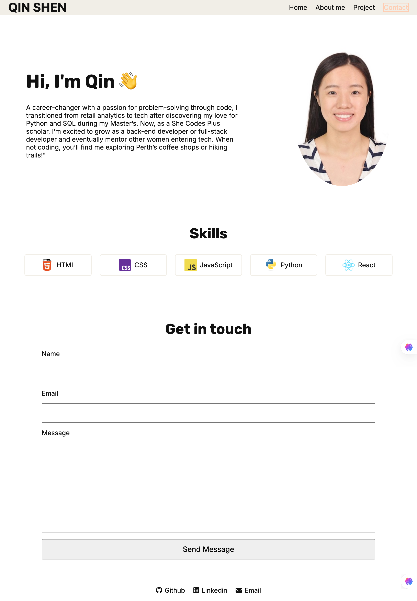

#  Qin Shen's Portfolio - Portfolio Task
​
[My portfolio site](https://qinshen-n.github.io/)
​
## Portfolio Description

### Content
 My portfolio showcases a clean, minimalist design with a focus on usability and performance. It includes a circular profile picture for a personal touch, a detailed bio section with readable typography, and an interactive contact form for easy communication. Projects are displayed in a responsive card grid with hover effects, while external links to GitHub and LinkedIn maintain branding consistency. Built with vanilla HTML/CSS for lightweight efficiency, the site prioritizes accessibility, mobile responsiveness, and fast loading times—achieving a professional aesthetic without unnecessary complexity.
​
### Technical
 My portfolio website was developed with a mobile-first approach, prioritizing clean aesthetics and technical robustness. The site consists of two interlinked pages (home and projects) built with semantic HTML5 for improved accessibility and SEO. All development was version controlled through Git, enabling structured collaboration and change tracking. For seamless deployment, I leveraged GitHub Pages which provides reliable hosting with automatic updates from the main branch. Responsive design was achieved through CSS Flexbox/Grid and strategic media queries, ensuring optimal viewing across all device sizes. This combination of thoughtful structure and modern web practices results in a fast, accessible, and maintainable digital portfolio.

### Bonus (optional)
 My portfolio implements foundational interactive elements, including:
 Hover states with CSS transitions (opacity/color shifts) to improve visual feedback
 A hamburger menu prototype for mobile navigation (HTML/CSS structure in place)
 But the JavaScript functionality isn’t yet fully operational, there are much area to be kepting learning.
​
### Screenshots
 Screenshots are available in the [**screenshots_website**] folder.

####  mobile_homepage 

####  tablet_homepage 

####  desktop_homepage_with_nav_hover 

####  mobile_projects_page_with_button_hover 
