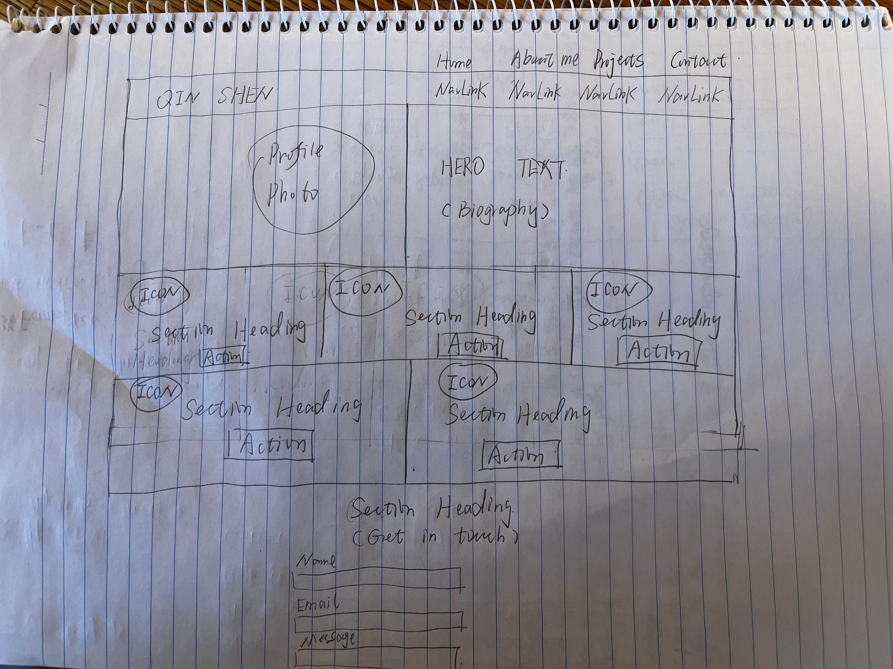
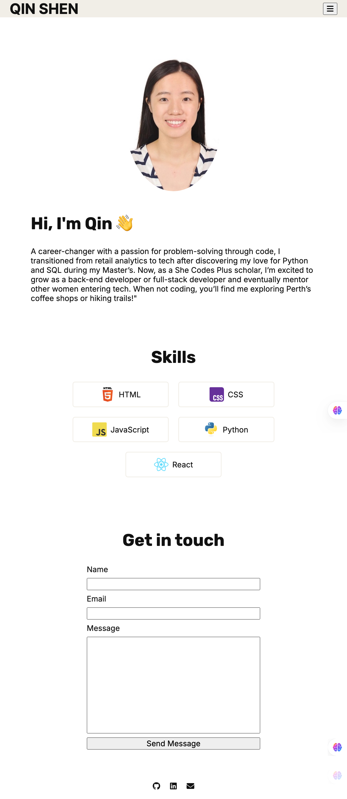
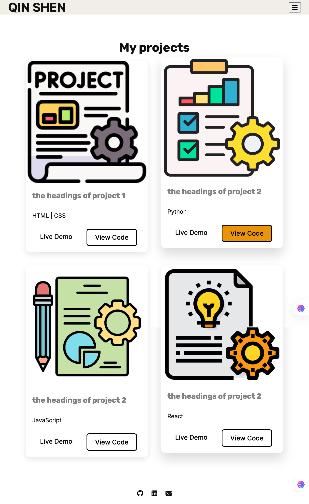
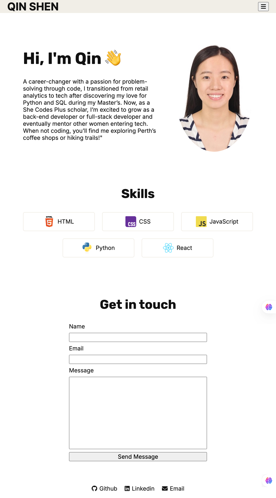
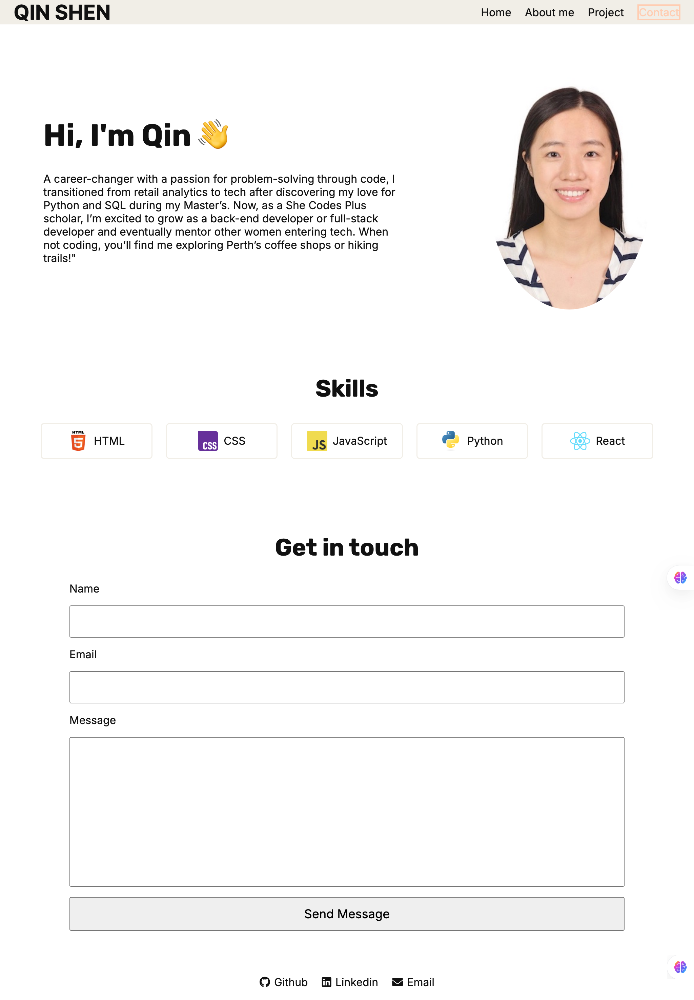
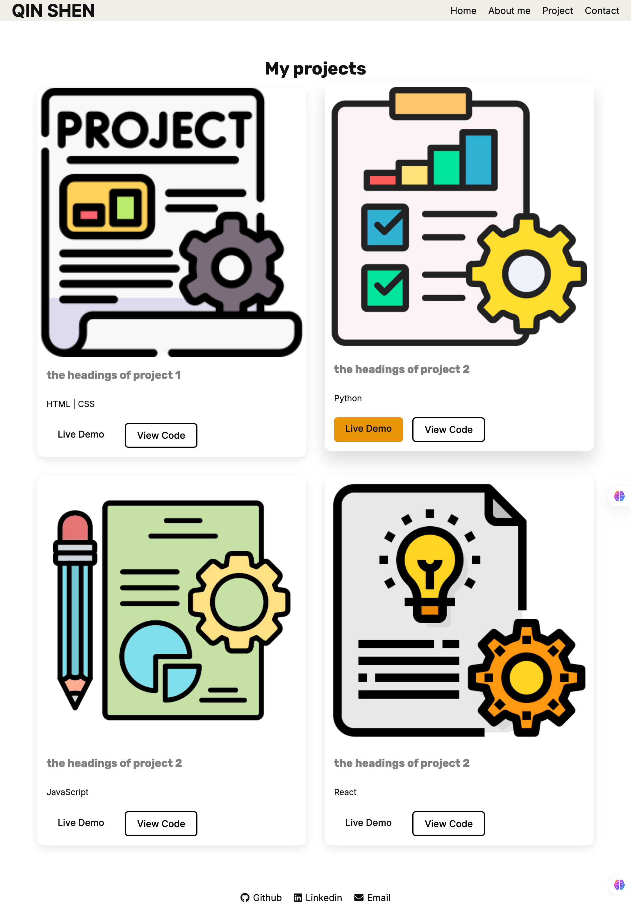

#  Qin Shen's Portfolio - Portfolio Task
​
[My portfolio site](https://qinshen-n.github.io/)
​
## Portfolio Requirements

### Content
 Add a short paragraph describing the features below. What aesthetic and technical choices did you make? 
- [x] At least one profile picture
- [x] Biography (at least 100 words)
- [x] Functional Contact Form
- [x] "Projects" section
- [x] Links to external sites, e.g. GitHub and LinkedIn.

My portfolio showcases a clean, minimalist design with a focus on usability and performance. It includes a circular profile picture for a personal touch, a detailed bio section with readable typography, and an interactive contact form for easy communication. Projects are displayed in a responsive card grid with hover effects, while external links to GitHub and LinkedIn maintain branding consistency. Built with vanilla HTML/CSS for lightweight efficiency, the site prioritizes accessibility, mobile responsiveness, and fast loading times—achieving a professional aesthetic without unnecessary complexity.
​
### Technical
 Add a short paragraph describing the features below. What strategies or design decisions did you work from? 
- [x] At least 2 web pages.
- [x] Version controlled with Git
- [x] Deployed on GitHub pages.
- [x] Implements responsive design principles.
- [x] Uses semantic HTML.

 My portfolio website was developed with a mobile-first approach, prioritizing clean aesthetics and technical robustness. The site consists of two interlinked pages (home and projects) built with semantic HTML5 for improved accessibility and SEO. All development was version controlled through Git, enabling structured collaboration and change tracking. For seamless deployment, I leveraged GitHub Pages which provides reliable hosting with automatic updates from the main branch. Responsive design was achieved through CSS Flexbox/Grid and strategic media queries, ensuring optimal viewing across all device sizes. This combination of thoughtful structure and modern web practices results in a fast, accessible, and maintainable digital portfolio.

### Bonus (optional)
Add a short paragraph describing the features below, if you included any. 
- [x] Different styles for active, hover and focus states.
- [ ] Include JavaScript to add some dynamic elements to your site. (Extra tricky!)
 My portfolio implements foundational interactive elements, including:
 - Hover states with CSS transitions (opacity/color shifts) to improve visual feedback
 - A hamburger menu prototype for mobile navigation (HTML/CSS structure in place)
 But the JavaScript functionality isn’t yet fully operational. I plan to complete it when learning Javascript and React.
​
### Screenshots
### Wireframes

#### Mobile Homepage Screenshots

#### Mobile Project Page Screenshots

#### Tablet Homepage & Projects Screenshots

#### Desktop Homepage Screenshots

#### Desktop Projects Screenshots

